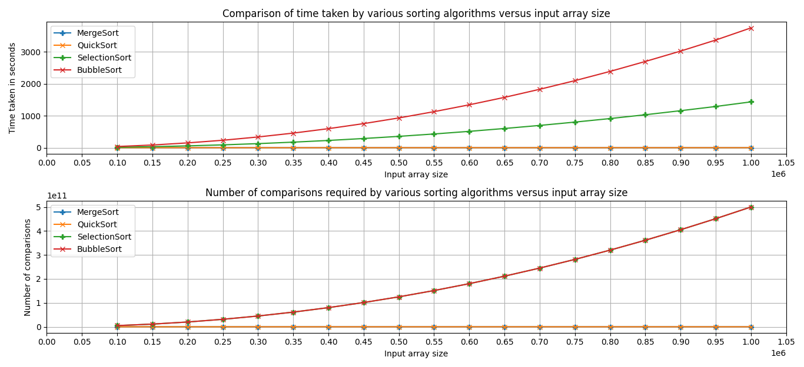

# Sorting-Algorithms
This is a comparison of the performance of some of the most popular sorting algorithms:
1. Quick Sort
2. Merge Sort
3. Selection Sort
4. Bubble Sort (Sightly optimised to need less than n(n-1)/2 comparisons for sorting an array of n elements)

## Files
1. *Sort.h* contains the function prototypes
2. *Sort.c* contains the function definitions
3. *Driver.c* contains the main function that is used to benchmark the aforementioned sorting algorithms
4. *Run.sh* is a shell script used to compile and run the benchmark as well as plot a graph of the observations
5. *Plot.py* is a python script that graphs the observations using **matplotib.pyplot** and **numpy**

## Output Directory Structure
The Analytics Folder contains the output graphs as well as four subfolders (one for each sorting algorithm). These folders inturn have two more subfolders:
1. *Element-to-Element-Comparisons-Only* - Contains observations about the algorithm when only element to element comparisons are considered as the basic task.
2. *Including-Loop-Comparisons* - Contains observations about the algorithm when all comparisons (including loop condition evaluation) are considered as the basic task.

The following graph is obtained when the algorithms are run for various input sizes considering element to element comparison as the basic task


## Dependencies
- A C++ compiler (*e.g.*, [GCC](http://gcc.gnu.org/))
- Python 3 with the following additional modules: 
    - Numpy
    - Matplotlib

## Compiling and Running the Benchmark

Clone the repository using:

```bash
$ git clone https://github.com/Dhruval360/Sorting-Algorithms.git
```

Execute the `Run.sh` script using:

```bash
$ chmod +x Run.sh
$ ./Run.sh
```
